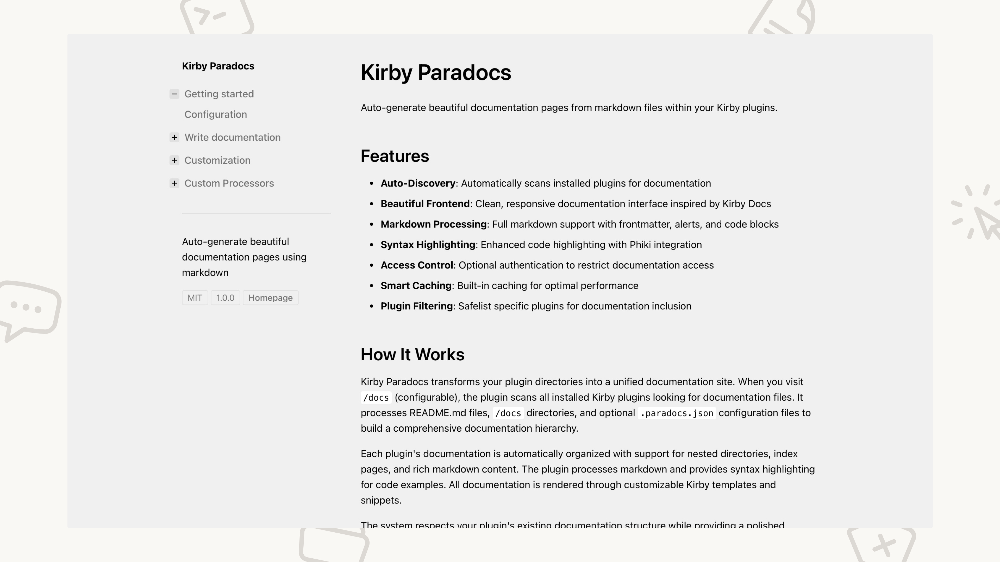

# Kirby Paradocs

Auto-generate beautiful documentation pages from markdown files within your Kirby plugins.

## Features

- **Auto-Discovery**: Automatically scans installed plugins for documentation
- **Beautiful Frontend**: Clean, responsive documentation interface inspired by Kirby Docs
- **Markdown Processing**: Full markdown support with frontmatter, alerts, and code blocks
- **Syntax Highlighting**: Enhanced code highlighting with Phiki integration
- **Access Control**: Optional authentication to restrict documentation access
- **Smart Caching**: Built-in caching for optimal performance
- **Plugin Filtering**: Safelist specific plugins for documentation inclusion

## How It Works

Kirby Paradocs transforms your plugin directories into a unified documentation site. When you visit `/docs` (configurable), the plugin scans all installed Kirby plugins looking for documentation files. It processes README.md files, `/docs` directories, and optional `.paradocs.json` configuration files to build a comprehensive documentation hierarchy.

Each plugin's documentation is automatically organized with support for nested directories, index pages, and rich markdown content. The plugin processes markdown and provides syntax highlighting for code examples. All documentation is rendered through customizable Kirby templates and snippets.

The system respects your plugin's existing documentation structure while providing a polished interface for end users. Whether you're documenting internal tools or public plugins, Paradocs creates a quick and good looking documentation experience.

## Quick Start


### Download

Download and copy this repository to `/site/plugins/kirby-paradocs`.

### Composer

```bash
composer require moinframe/kirby-paradocs

# With enhanced syntax highlighting
composer require moinframe/kirby-paradocs phiki/phiki
```

### Git submodule

```sh
git submodule add https://github.com/moinframe/kirby-paradocs.git site/plugins/kirby-paradocs
```

### Visit your documentation:
Navigate to `/docs` in your Kirby site to view the generated documentation. You have to be logged in to the Kirby Panel if not otherwise configured.

## Documentation

- [Getting started](docs/01-getting-started/index.md) - Complete setup instructions
- [Writing docs](docs/02-write-docs/index.md) - How to write documentation
- [Customization](docs/02-write-docs/index.md) - Customize to fit your site
- [Custom Processors](docs/02-write-docs/index.md) - Extend the system with custom processors

## Requirements

- **Kirby CMS:** 4.6+
- **PHP:** 8.3+
- **Optional:** [Phiki](https://github.com/phikiphp/phiki) for enhanced syntax highlighting

## Support

- **Documentation:** [Website](https://moinfra.me/docs/moinframe-paradocs)
- **Issues:** [GitHub Issues](https://github.com/moinframe/kirby-paradocs/issues)
- **Source Code:** [GitHub Repository](https://github.com/moinframe/kirby-paradocs)

## License

[MIT License](LICENSE.md)
